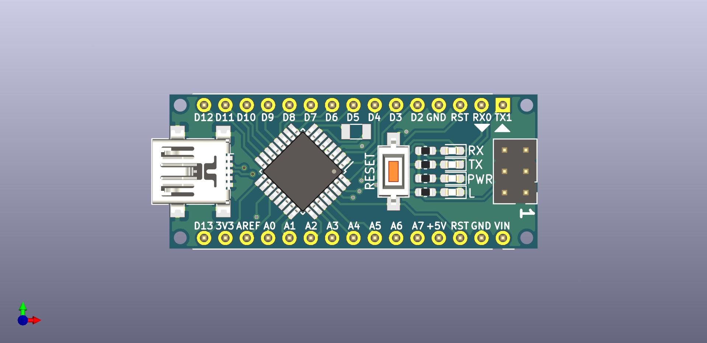
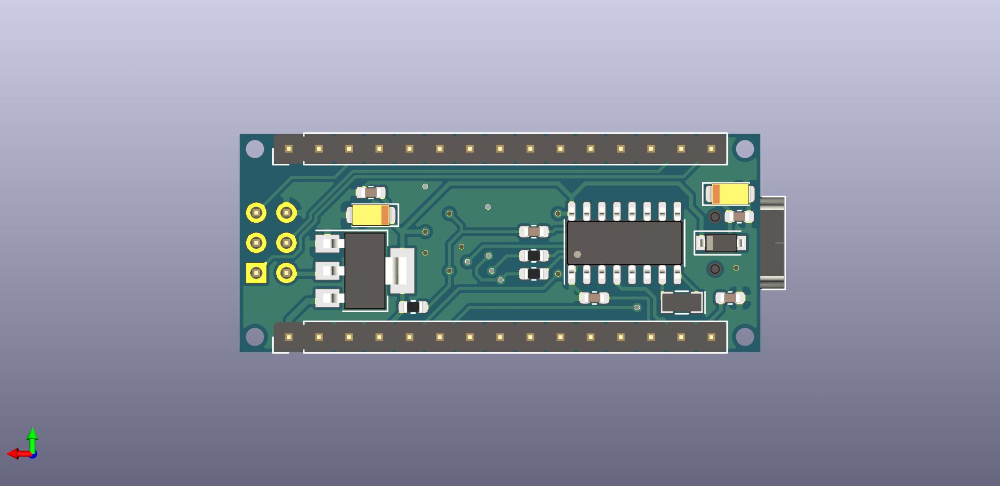

# Arduino Nano CH340G Reverse Engineering

## Description

Reverse engineered using manual measurements without consulting official schematics for study only.

You may find the pdf version of the  on *./extra* folder.

## Other sources of good knowledge

http://actrl.cz/blog/index.php/2016/arduino-nano-ch340-schematics-and-details/
https://www.instructables.com/id/Arduino-Nano-ATmega238PCH340G-v30-PCB-layout/
